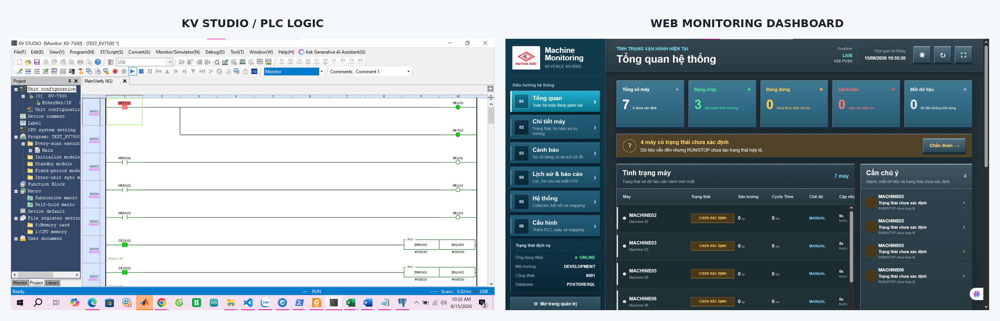
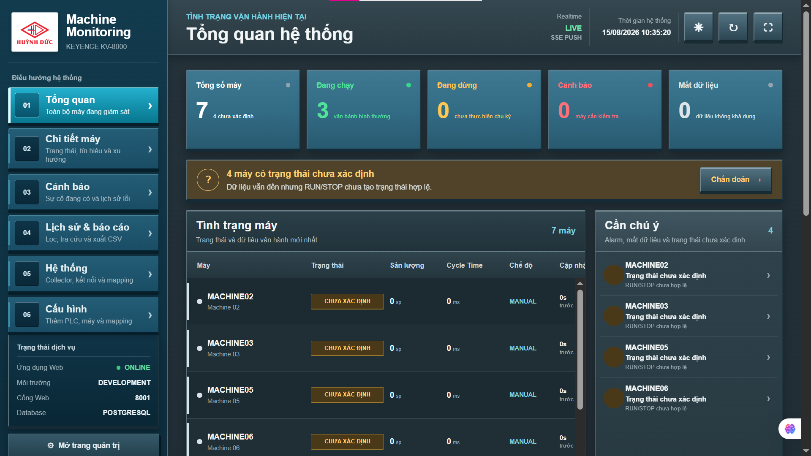
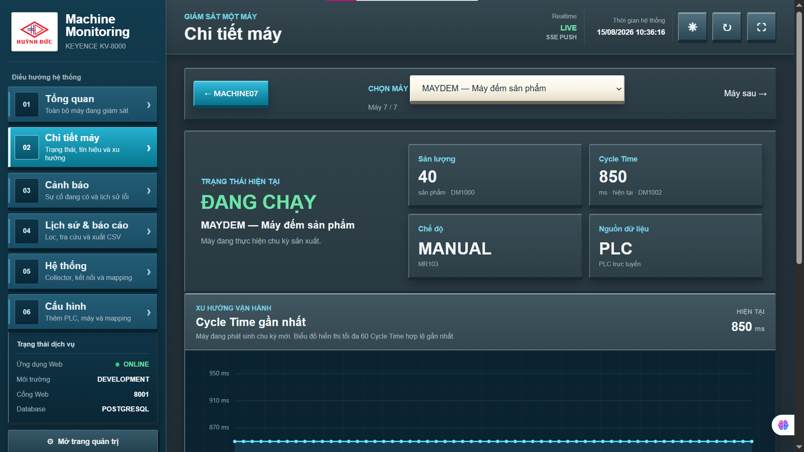
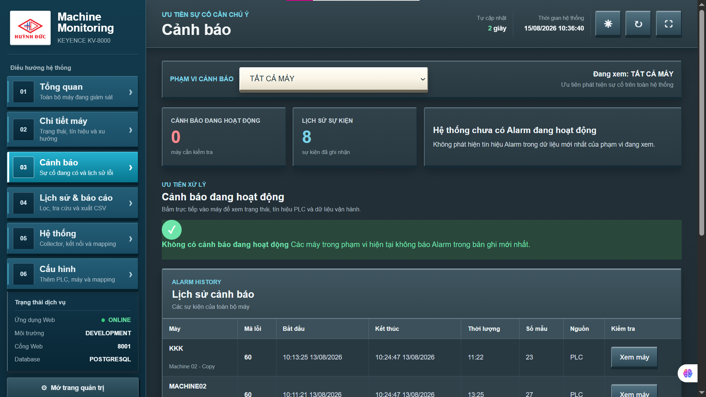
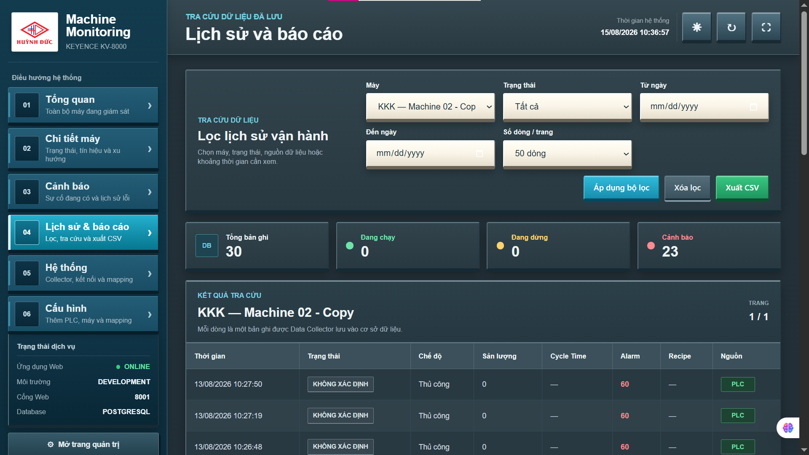
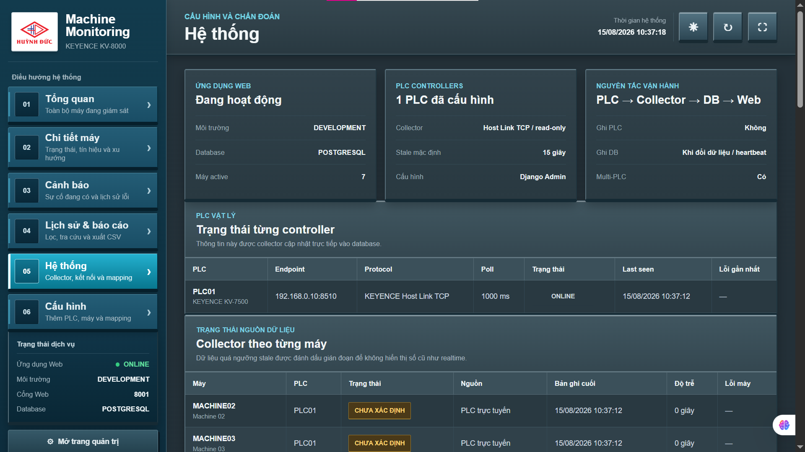
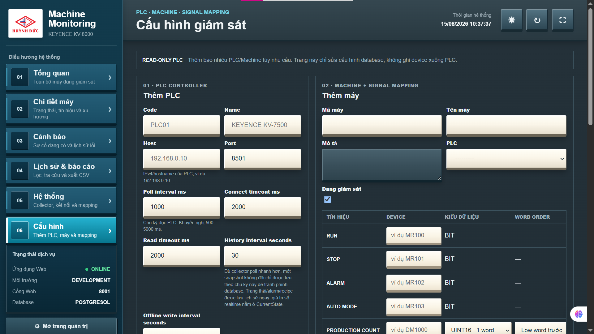
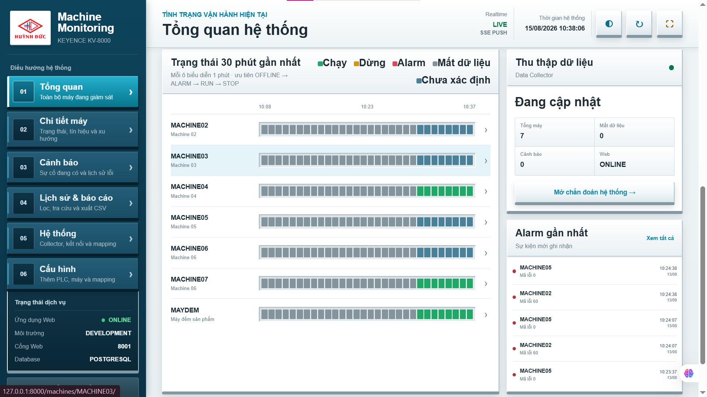

# KEYENCE KV-Series PLC Machine Monitoring System

A real-time industrial machine monitoring platform built with **Python, Django, PostgreSQL, and a custom PLC data collector**.

The system reads production signals from KEYENCE PLCs over **Host Link TCP**, stores operational data centrally, and presents machine status, production count, cycle time, alarms, history, and diagnostics through a browser-based monitoring dashboard.

> **Hardware validation:** the test setup shown in this repository uses a **KEYENCE KV-7500** PLC. The software architecture is designed around KEYENCE KV-series communication and the repository retains its original KV8000 project name.

---

## End-to-End Demonstration



The demonstration connects PLC logic monitored in **KV STUDIO** to the Python collector and Web monitoring interface.

```text
KEYENCE PLC
    │
    │  Host Link TCP / Read-only
    ▼
Python PLC Collector
    │
    ▼
PostgreSQL
    │
    ▼
Django Application
    │
    ├── Server-Sent Events (SSE)
    └── Historical queries / reports
    ▼
Web Monitoring Dashboard
```

---

## Hardware Validation

The project was tested with a physical KEYENCE PLC and a development laptop running both KV STUDIO and the monitoring application.


The hardware test demonstrates that the project is not only a UI prototype: PLC signals are collected from a real controller and propagated through the software stack to the monitoring dashboard.

<details>
<summary>View PLC / KV STUDIO hardware test</summary>


</details>

---

## Key Features

- Real-time multi-machine status monitoring
- KEYENCE Host Link TCP communication
- Read-only PLC data collection
- Production count and cycle-time tracking
- RUN / STOP / ALARM / AUTO signal mapping
- Machine-level trend visualization
- Alarm detection and alarm history
- Historical operating data and CSV export
- PLC connection and collector diagnostics
- Multi-PLC and multi-machine configuration
- PostgreSQL data persistence
- Server-Sent Events (SSE) for live Web updates
- Stale-data detection to avoid presenting old values as realtime data
- Separate Web and collector processes for easier deployment and troubleshooting

---

## Real-Time Dashboard



The overview consolidates the operating state of all monitored machines. It displays machine count, running/stopped state, alarms, data availability, recent updates, and items requiring attention.

The dashboard receives live updates from the backend using **SSE push**, allowing operators to monitor the system without manually refreshing the page.

---

## Machine-Level Monitoring



Each machine has a dedicated monitoring page showing:

- current operating state;
- production count;
- cycle time;
- operating mode;
- data source;
- recent cycle-time trend.

This view allows the operator to move from a plant-level overview to individual machine behavior.

---

## Alarm Monitoring



The alarm page separates current alarms from historical events and records information such as the affected machine, alarm code, start/end time, duration, sample count, and data source.

This provides a traceable operational history instead of relying only on the current PLC state.

---

## Historical Data & Reporting



Stored PLC readings can be filtered by:

- machine;
- operating state;
- date range;
- number of records per page.

The application also supports **CSV export** for offline reporting and further analysis.

---

## System Diagnostics



The diagnostics page exposes the health of the monitoring pipeline:

```text
PLC → Collector → Database → Web
```

It shows PLC controller connectivity, communication protocol, polling interval, latest collector update, machine data freshness, and the most recent error state.

The collector is designed as **read-only** toward the PLC, reducing the risk of the monitoring application modifying control logic or device values.

---

## PLC & Signal Configuration



PLC controllers and machine mappings are managed from the Web configuration layer.

Typical signals include:

| Signal | Example Role |
|---|---|
| RUN | Machine running state |
| STOP | Machine stopped state |
| ALARM | Fault/alarm state |
| AUTO MODE | Automatic/manual operating mode |
| PRODUCTION COUNT | Production counter |
| CYCLE TIME | Machine cycle duration |

Communication settings such as host, port, polling interval, connection timeout, read timeout, and history interval can be managed without hard-coding them into the collector source.

---

## Realtime State Timeline



The timeline view provides a compact visualization of recent machine states and collector activity, helping operators identify changes between running, stopped, alarm, missing-data, and undefined states.

---

## Tech Stack

| Layer | Technology |
|---|---|
| PLC / Automation | KEYENCE KV-series, KV STUDIO |
| PLC Communication | KEYENCE Host Link TCP |
| Data Collector | Python |
| Backend | Django |
| Database | PostgreSQL |
| Realtime Web Updates | Server-Sent Events (SSE) |
| Frontend | Django Templates, HTML, CSS, JavaScript |
| Deployment / Operations | PowerShell scripts |
| Version Control | Git, GitHub |

---

## Architecture

The project separates industrial communication from the Web application.

### 1. PLC Layer

The KEYENCE PLC exposes device values representing machine state and production signals.

### 2. Collector Layer

The Python collector:

- establishes the PLC connection;
- reads configured devices;
- parses Host Link responses;
- normalizes machine state;
- writes current and historical data to PostgreSQL;
- records communication health and errors.

### 3. Data Layer

PostgreSQL acts as the central source of truth for:

- PLC controllers;
- machine definitions;
- signal mappings;
- current machine state;
- historical readings;
- alarm events.

### 4. Web Layer

Django provides:

- realtime monitoring pages;
- machine detail views;
- alarm history;
- historical filtering;
- CSV export;
- system diagnostics;
- PLC and machine configuration.

---

## Project Structure

```text
KV8000-Machine-Monitoring/
│
├── collector/
│   ├── keyence_hostlink.py
│   ├── plc_collector.py
│   ├── mock_collector.py
│   └── test_keyence_hostlink.py
│
├── dashboard/
│   ├── machine_monitoring/
│   ├── monitoring/
│   │   ├── management/
│   │   ├── migrations/
│   │   ├── static/
│   │   ├── templates/
│   │   ├── models.py
│   │   ├── views.py
│   │   └── forms.py
│   └── manage.py
│
├── scripts/
│   ├── start_web.ps1
│   ├── start_collector.ps1
│   ├── start_all.ps1
│   └── health_check.ps1
│
├── docs/
│   └── screenshots/
│
├── .env.example
├── .gitignore
├── requirements.txt
└── README.md
```

---

## Running the Project

### Requirements

- Windows
- Python virtual environment
- PostgreSQL
- Network access to the PLC
- KEYENCE PLC configured for the expected Host Link TCP communication

### Environment

Create the local environment file from the provided template:

```powershell
Copy-Item .env.example .env
```

Configure the local database and application settings in `.env`.

> The real `.env` file is intentionally excluded from Git because it contains local credentials and environment-specific configuration.

### Run the Web Application

From the project root:

```powershell
cd .\dashboard
python manage.py runserver
```

### Run the PLC Collector

Open a second terminal from the project root:

```powershell
python .\collector\plc_collector.py
```

Keep the Web server and collector running simultaneously during live monitoring.

---

## Security & Repository Hygiene

This public repository intentionally excludes:

- `.env` files;
- database passwords;
- Django production secret keys;
- local virtual environments;
- local SQLite/runtime databases;
- logs;
- generated caches;
- backup source files.

PLC communication is implemented as **read-only monitoring** in the current architecture.

---

## Testing

The project contains tests for both the Web application and PLC communication components, including:

```text
collector/test_keyence_hostlink.py
dashboard/monitoring/tests.py
dashboard/monitoring/test_collector.py
```

Testing focuses on communication parsing, machine-state processing, monitoring logic, and Web behavior.

---

## Future Improvements

Potential extensions include:

- deployment behind a production reverse proxy;
- HTTPS for internal networks;
- service-based collector/web startup;
- richer OEE and production analytics;
- notification integration for critical alarms;
- long-term data retention policies;
- additional KEYENCE PLC models and protocol variants;
- role-based configuration permissions.

---

## Project Scope

This project demonstrates an end-to-end industrial monitoring workflow combining:

**PLC Communication · Python Data Acquisition · PostgreSQL · Django Web Development · Realtime SSE · Industrial Diagnostics · Historical Reporting · Hardware Validation**

